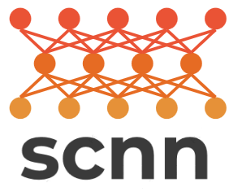

`scnn` is a collection of deep learning algorithms for the analysis of high-dimensional, high-throughput data, with a particular focus on single-cell genomics. `scnn` is currently under development and will soon contain methods for running:

* [SAUCIE](https://github.com/KrishnaswamyLab/SAUCIE)
* [MAGAN](https://github.com/KrishnaswamyLab/MAGAN)
* [AANet](https://github.com/KrishnaswamyLab/AANet)

## Installation

You can install `scnn` with `pip`:

```
pip install --user git+https://github.com/KrishnaswamyLab/scnn
```
